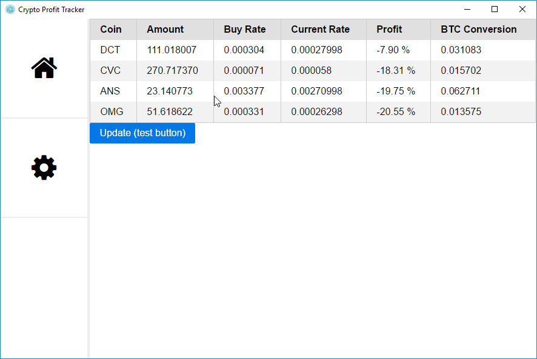
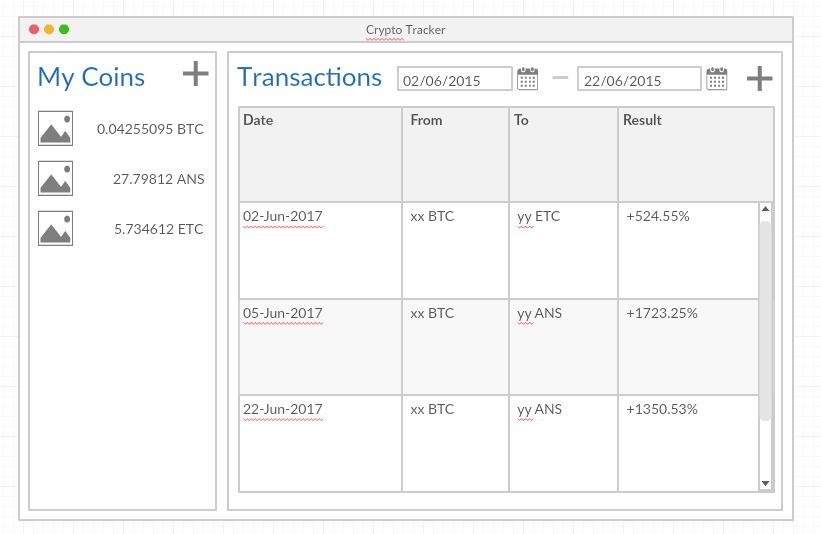

# Crypto Profit Tracker

Consolidate the data taken from Bittrex account through API Key, show current portfolio with the margin (gain / loss percentage).

## Preview (Alpha State)



## Usage

    npm install -g electron
    electron .

Input your API Key and Secret in the setting page, and submit (ONLY USE API w/ READ INFO PERMISSION, FURTHER PERMISSIONS ARE UNNECESSARY)

On later version, electron should be installed as non-devDependencies and just add run script. Maybe add binary release using ```electron-package```

## Database

There will be two tables: **portfolio** and **metadata**

#### Portfolio
| coin | amount | buy_rate |
| :--: | -----: | -------: |
| ANS | 23.115 | 0.00341223 |
| BTC | 0.425 | 1 |
| ETH | 10.523 | 0.13341578 |

#### Metadata
| meta | value |
| :--: | -----: |
| api_key | *bittrex api key* |
| secret_key | *bittrex secret key* |
| last_sync | *unix long time* |
| last_tx_uuid | *tx id from bittrex* |

## Mockup



Created using [creately.com](https://creately.com/)

## TODO Checklist

[x] Connect and get all transactions from Bittrex through the API.

[x] Consolidate the transactions data based on Deposit, Withdrawal, and Order History

[x] Display all assets and the average buy rate of it.

[x] Fix bug where updated ticker will mess the order of the odd and non-odd <td>

[x] Update UI to match initial mock, show last sync time and sync button on the bottom of the window.

[ ] Design a database structure to keep the portfolio and the last transaction sync'd. (Currently it's fetching all transactions and recalculating every time)

[ ] Sort by field.

[x] Show loading animation if data is being fetched.

[x] Effect for Sidebar Buttons Hover.
