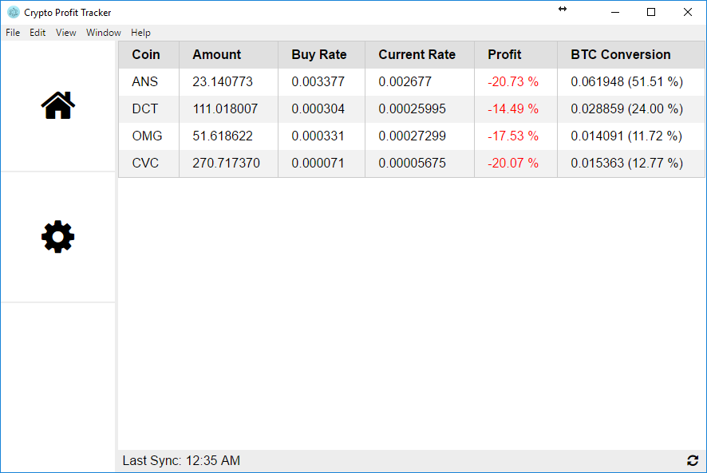

# Crypto Profit Tracker

Averaging up / down during trading can sometimes be troublesome as you want to find out the final rate that you get after all the transactions. Instead of using excel and have your time wasted, this app takes all your Bittrex transactions and help you calculate the final rate and display your portfolio with needed information.

This is currently still in ALPHA state, meaning the development is still ongoing and it might have lots of bugs.

## Preview (Alpha State)



## Usage

Download binary source or if you are a developer:

    npm install -g electron
    electron .

Input your API Key and Secret in the setting page, and submit (ONLY USE API w/ READ INFO PERMISSION, FURTHER PERMISSIONS ARE UNNECESSARY)

On later version, electron should be installed as non-devDependencies and just add run script. Maybe add binary release using ```electron-package```

## Database

There will be two tables: **portfolio** and **metadata**

#### Portfolio
| coin | amount | buy_rate | market |
| :--: | -----: | -------: | -----: |
| ANS | 23.115 | 0.00341223 | "BTC-ANS" |
| BTC | 0.425 | 1 | - |
| ETH | 10.523 | 0.13341578 | "BTC-ETH" |

#### Metadata
| meta | value |
| :--: | -----: |
| api_key | *bittrex api key* |
| secret_key | *bittrex secret key* |
| last_sync | *unix long time* |
| last_tx_id | *tx id from bittrex* |

## Mockup


Created using [creately.com](https://creately.com/)

## TODO

- When sync'ing with CSV, also fetch order via API in case the fullOrders is not the latest one.

- Show BTC and USD worth of money on footer.

- Sort by field.

- Add Auto-Refresh Every x Minute
