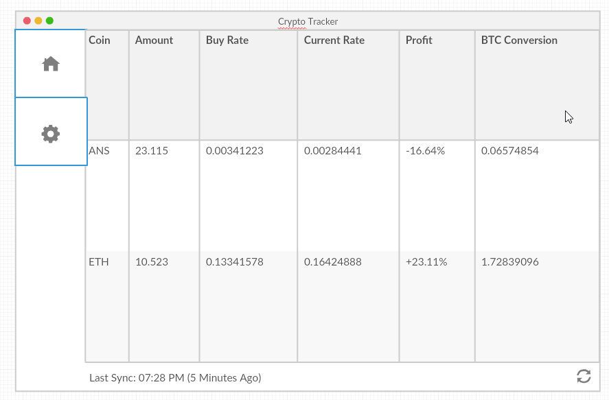

# Crypto Profit Tracker

Wrote this project because can't find a way to keep tracks of CryptoCoins that I bought at certain trade price in relative to the price of the coin being bought then keep tracks of my gains comparing to the current trade price. API is expected to be taken from [coincap.io](http://coincap.io/).

## Mockup

Created using [creately.com](https://creately.com/)

## What are the "Result" column on Mockup?

The increase of value in the original currency when you convert it back. For example, in the first row, I trade 2 BTC to 10 ETC, then if I trade my 10 ETC **now** I will get 5 BTC. So the result shall be: 5 / 2 * 100% = 250%

## TODO Checklist

[ ] Add certain coin manually.

[ ] Input a Buy / Sell Transactions: Date, From, Value, Result.

[ ] Display all CryptoCurrency assets.

[ ] Display all Transactions.

[ ] Query Transactions from certain Date ranges.
